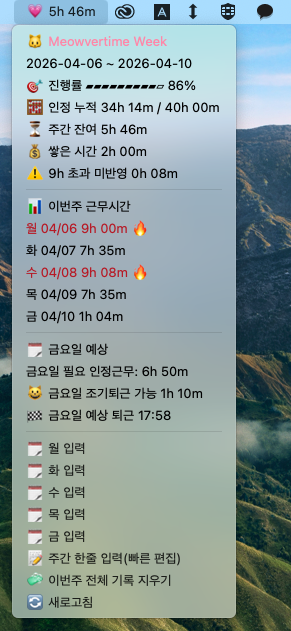

# meowvertime

### 고양이처럼 앙큼하게 퇴근하자구 미야오~

맥 상단바(SwiftBar)에서 가볍게 쓰는 회사용 주간 근무시간 계산기애옹

- 월~금 출퇴근 기록을 하루씩 차곡차곡 저장해옹
- 주 40시간 기준으로 잔여/초과 시간을 바로 확인해옹
- 일별 인정근무는 최대 9시간(기본 8h + 오버타임 1h cap)까지 반영해옹
- 금요일 필요 인정근무와 예상 퇴근 시각까지 보여줘옹

## 스크린샷



## 1) 구성

- 실행 스크립트: `scripts/swiftbar/meowvertime.1m.js`

## 2) SwiftBar 연결

SwiftBar 설치 후 플러그인 폴더에 아래 파일을 넣어주새옹

- `scripts/swiftbar/meowvertime.1m.js`
- `.env.swiftbar` (선택, 설정 커스텀할 때)

예시 복사:

```bash
cp scripts/swiftbar/meowvertime.1m.js "$HOME/Library/Application Support/SwiftBar/Plugins/"
chmod +x "$HOME/Library/Application Support/SwiftBar/Plugins/meowvertime.1m.js"
```

`1m`은 1분마다 자동으로 새로고침된다는 뜻이다옹

## 3) 계산 규칙

- 주간 목표: `40h` (월~금)
- 일별 인정근무: `max(0, 퇴근-출근-휴게)`
- 일별 인정 상한: `9h` (8h + 1h)
- `9h` 초과분은 주간 합산에 반영되지 않는다냥
- 금요일 필요 인정근무 = `40h - (월~목 인정 누적)`
- 점심/휴게: `12:30~13:30` 고정(60분, 자동 차감)

## 4) SwiftBar 입력 방식

드롭다운에서 아래 메뉴로 입력해옹

- `월 입력`
- `화 입력`
- `수 입력`
- `목 입력`
- `금 입력`
- `주간 한줄 입력(빠른 편집)`

`월/화/수/목/금 입력`은 해당 요일만 팝업으로 수정할 수 있다옹

- `H`: 공휴일(자동 8h)
- `-`: 미입력

입력 형식:

```text
09:00-18:00, 09:00-19:00, H, -, 09:00-
```

요일 라벨 버전도 사용할 수 있냥!:

```text
월 09:00-18:00, 화 09:00-19:00, 수 H, 목 -, 금 09:00-
```

주간 기록은 JSON 파일에 저장돼옹.

- 기본 위치: `scripts/swiftbar/.meowvertime-state.json`
- 원하는 위치로 변경: `MEOW_STATE_FILE`

## 5) 환경변수

```bash
MEOW_ENV_FILE=/path/.env.swiftbar             # 선택
MEOW_STATE_FILE=/path/.meowvertime-state.json # 선택
MEOW_HOLIDAYS=2026-01-01,2026-03-01           # 선택 (자동 공휴일)
```

## 6) 터미널 미리보기

```bash
npm run swiftbar:preview
```
